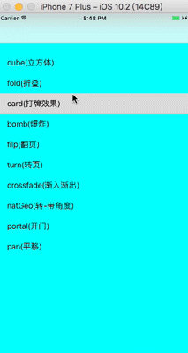
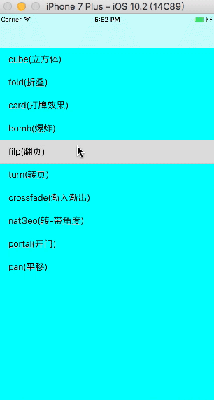
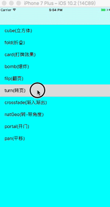
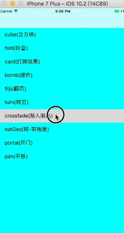
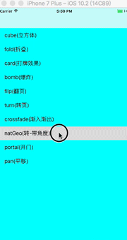
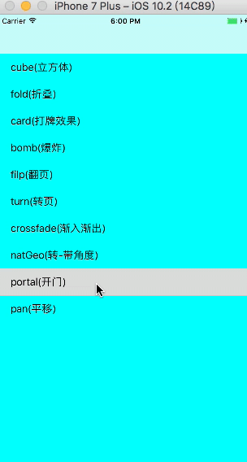
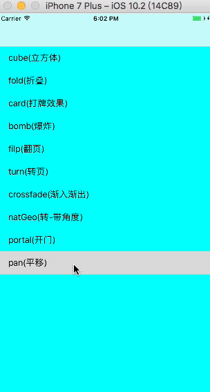

# AnimationTransitioning
##转场动画,为了方便使用,整理了 [VCTransitionsLibrary](https://github.com/ColinEberhardt/VCTransitionsLibrary) 的一些动画
有 10 种转场动画,详见 `demo`, 由于附带 `.gif` ,所以文件有点大.
##1.cube 

##2.fold 

##3.card

##4.bomb

##5.filp

##6.turn

##7.crossfade

##8.natgeo

##9.portal

##10.pan


#How to use?
1.遵循代理 `UINavigationControllerDelegate` </br>
  `self.navigationController.delegate = self;` </br>
  
2.代理方法 
```Objective-c
- (id<UIViewControllerAnimatedTransitioning>)navigationController:(UINavigationController *)navigationController 
animationControllerForOperation:(UINavigationControllerOperation)operation fromViewController:(UIViewController *)fromVC 
toViewController:(UIViewController *)toVC
{
	CubeTransitioning *cubeTransitioning = [[CubeTransitioning alloc]init];
    return cubeTransitioning;
}
```